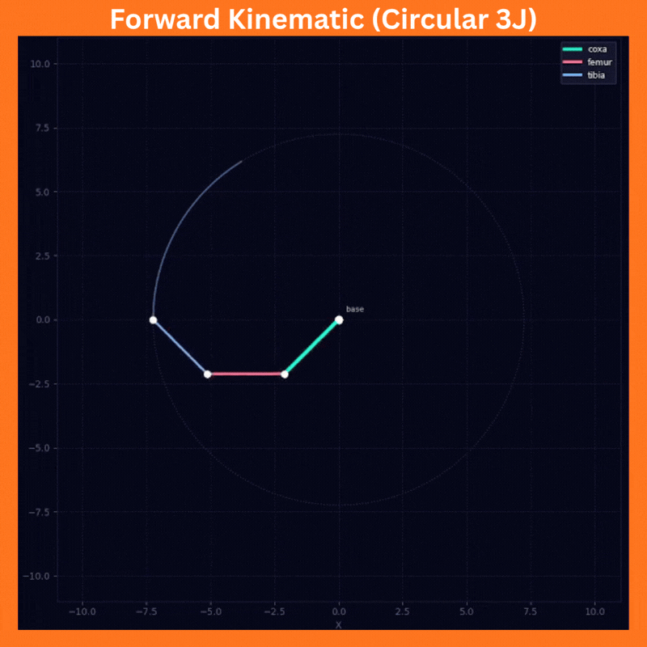

# Repository RE-608 [WEEK-2 Assignment]
### STATUS = COMPLETED
---

Di assignment ini saya ditugaskan untuk membuat sebuah visualisasi pergerakan kaki 3 Joint (3 engsel) yang menggunakan logika gerak Forward Kinematic lalu mevisualisasikannya menggunakan MatPlotLib.  
Disini saya menggunakan referensi Inverse Kinematic Matplotlib dari teman saya yang dimana referensi ini saya gunakan untuk membuat versi Froward Kinematicnya, hasil dari program visualisasi saya dapat dilihat pada GIF dibawah ini:  
 

