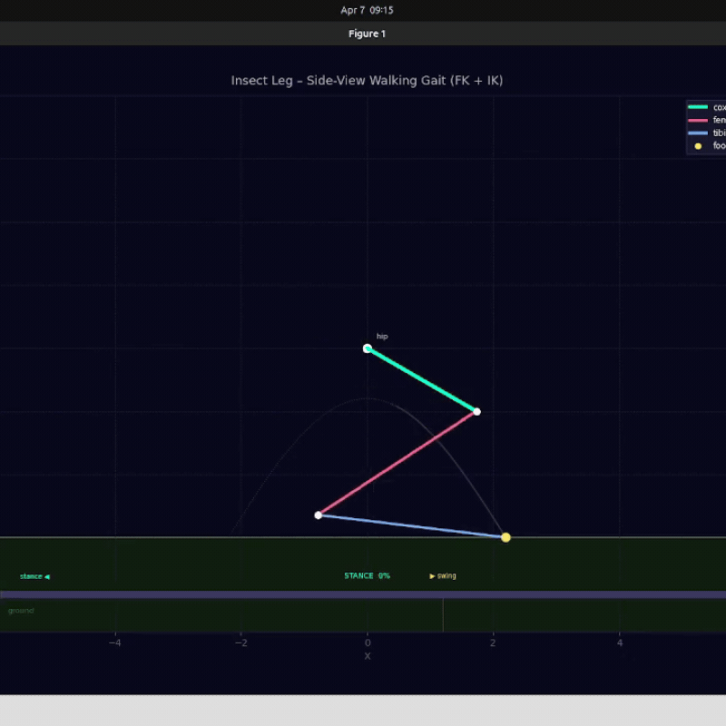

# Repository RE-608 [WEEK-3 Assignment]
### STATUS = WORK IN PROGRESS
---
<br>
   <br>
<br>

### Pergerakan kaki 3 Joint menggunakan simple 2D Planar (IK + FK)

Sama seperti pada minggu sebelumnya, berikut adalah rumus FK yang di gunakan: <br>
```
a1 = θ1
P1 = origin + L_coxa  · [cos(a1), sin(a1)]

a2 = a1 + θ2
P2 = P1     + L_femur · [cos(a2), sin(a2)]

a3 = a2 + θ3
P3 = P2     + L_tibia · [cos(a3), sin(a3)]

aₙ = aₙ₋₁ + θₙ                        (mengkalkulasikan absolute angle)
Pₙ = Pₙ₋₁ + Lₙ · [cos(aₙ), sin(aₙ)]   (arah extensi)
```
<br>

### Inverse Kinematik (IK) 2 link penghubung Coxa-Femur-Tibia
Kaki mengikuti path yang sudah di tentukan (dapat di lihat di GIF diatas) dan path itu sudah di atur anglenya melewati IK menggunakan rumus/hukum Cosinus pada kaki bagian Femur + Tibia. <br>
```
d = ||target - P1||          (distance from coxa tip to foot)

cos(α) = (L_femur² + d² - L_tibia²) / (2 · L_femur · d)

α = arccos(cos(α))           (angle at femur root inside triangle)

θ_femur = atan2(Δy, Δx) - α  (elbow-down solution)
```
yang kemudian akan diikuti oleh pergerakan kaki (jadi alur program ini berjalan mundur (backward) dimana kaki hanya mengikuti pergerakan yang sudah di tentukan derajatnya menggunakan IK. <br>
```
P2 = P1 + L_femur · [cos(θ_femur), sin(θ_femur)]

θ_tibia_world = atan2(foot_y - P2_y, foot_x - P2_x)
θ_tibia_rel   = θ_tibia_world - θ_femur
```

### Gait yang digunakan
```
P2 = P1 + L_femur · [cos(θ_femur), sin(θ_femur)]

θ_tibia_world = atan2(foot_y - P2_y, foot_x - P2_x)
θ_tibia_rel   = θ_tibia_world - θ_femur
```

Sehingga IK mengkalkulasikan perhitungannya dan FK di gunakan untuk memanggil atau menggerakkan kaki ke posisi Joint (angle) sebenarnya yang sudah di lakukan oleh IK. `0 = -30°` ini adalah angle Coxa yang saya set Fixed sehingga hanya Femur dan Tibia yang memerlukan IK meniru pergerakan sebuah kaki Jangkrik.
