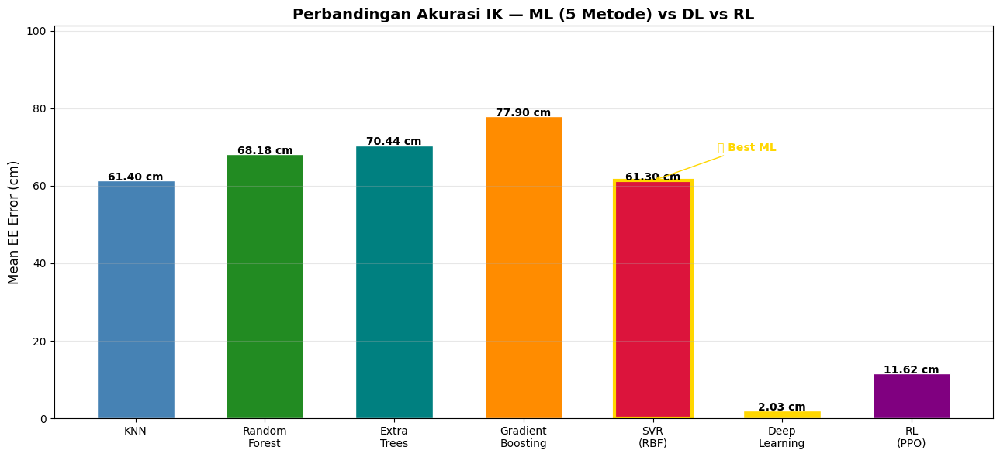

# Inverse Kinematics Planar Robot 3-DOF
### Tugas Praktikum — Pendekatan Machine Learning, Deep Learning, dan Reinforcement Learning

---

## Deskripsi

Proyek ini mengimplementasikan **Inverse Kinematics (IK)** untuk robot planar 3-DOF menggunakan tiga pendekatan AI:

- **Machine Learning (Supervised)** — 5 model regresi: KNN, Random Forest, Extra Trees, Gradient Boosting, SVR
- **Deep Learning** — MLP dengan PyTorch, loss dihitung di ruang kartesian
- **Reinforcement Learning** — Custom Gymnasium environment + PPO (Stable Baselines3)

> **Tugas Praktikum yang diselesaikan:**
> 1. ✅ Ubah panjang link menjadi `[0.5, 0.4, 0.3]` dan bandingkan hasilnya
> 2. ✅ Optimasi metode machine learning — ditambahkan Extra Trees, Gradient Boosting, dan SVR; serta optimasi hiperparameter KNN dan Random Forest

---

## Konfigurasi Robot

| Parameter | Nilai |
|-----------|-------|
| Link lengths | `L1 = 0.5 m`, `L2 = 0.4 m`, `L3 = 0.3 m` |
| Max reach | `0.9 m` |
| Joint limits | `θ1: ±180°`, `θ2: ±120°`, `θ3: ±90°` |
| Degrees of Freedom | 3-DOF planar |

### Persamaan Forward Kinematics
```
x = L1·cos(θ1) + L2·cos(θ1+θ2) + L3·cos(θ1+θ2+θ3)
y = L1·sin(θ1) + L2·sin(θ1+θ2) + L3·sin(θ1+θ2+θ3)
```

---

## Dataset

Dataset dibuat via **FK sampling** (random joint angles → hitung posisi EE):

| Keterangan | Nilai |
|------------|-------|
| Total sampel awal | 18.000 |
| Sampel reachable | 16.876 (93.8%) |
| Sampel dibuang | 1.124 (6.2%) |
| Train / Test split | 13.500 / 3.376 (80/20) |
| Input | `[x, y]` — posisi end-effector |
| Output | `[θ1, θ2, θ3]` — sudut sendi (radian) |

---

## Bagian 4: Machine Learning (Supervised) — Hasil Optimasi

Model-model dilatih menggunakan `StandardScaler` untuk normalisasi input.

### Metode & Konfigurasi

| Model | Konfigurasi Utama |
|-------|-------------------|
| **KNN** *(Optimized)* | `k=7`, `weights='distance'`, `metric='euclidean'` |
| **Random Forest** *(Optimized)* | `n_estimators=200`, `max_depth=20`, `min_samples_leaf=2` |
| **Extra Trees** *(Baru)* | `n_estimators=200`, `max_depth=20`, `min_samples_leaf=2` |
| **Gradient Boosting** *(Baru)* | `n_estimators=100`, `lr=0.1`, `max_depth=5`, wrapped in `MultiOutputRegressor` |
| **SVR (RBF)** *(Baru)* | `kernel='rbf'`, `C=10`, `epsilon=0.01`, `gamma='scale'`, wrapped in `MultiOutputRegressor` |

### Hasil

| Ranking | Model | Mean EE Error | Training Time |
|---------|-------|:-------------:|:-------------:|
| 🥇 1 | SVR (RBF) | **61.30 cm** | 8.1 s |
| 🥈 2 | KNN (Optimized) | **61.40 cm** | 0.0 s |
| 🥉 3 | Random Forest | 68.18 cm | 0.7 s |
| 4 | Extra Trees | 70.44 cm | 0.3 s |
| 5 | Gradient Boosting | 77.90 cm | 4.1 s |

> **Catatan:** Error yang tinggi pada metode ML (>60 cm) adalah tipikal untuk masalah IK supervised karena **ambiguitas solusi** — satu posisi EE dapat dicapai oleh banyak konfigurasi sudut yang berbeda. Model memilih salah satu solusi, sementara ground truth menggunakan solusi lain. Ini bukan indikasi model gagal, melainkan sifat inheren dari IK.

---

## Bagian 5: Deep Learning (PyTorch MLP)

### Arsitektur IKNet

```
Input (2) → Linear(256) → BN → ReLU
          → Linear(512) → BN → ReLU → Dropout(0.1)
          → Linear(512) → BN → ReLU → Dropout(0.1)
          → Linear(256) → BN → ReLU
          → Linear(3)   → tanh × π    → Output (3)
```

- Total parameter: **530,179**
- Loss function: MSE di **ruang kartesian** (bukan angle space)
- Optimizer: Adam (`lr=1e-3`, `weight_decay=1e-5`)
- Scheduler: CosineAnnealingLR (`T_max=100`)

### Training Progress

| Epoch | Train Loss | Val Loss |
|-------|-----------|---------|
| 20 | 0.007059 | 0.006452 |
| 40 | 0.004974 | 0.004352 |
| 60 | 0.003625 | 0.002093 |
| 80 | 0.003513 | 0.001690 |
| 100 | 0.002948 | 0.001958 |

### Hasil

| Metrik | Nilai |
|--------|-------|
| Mean EE Error | **2.03 cm** |
| Device | CPU |

---

## Bagian 6: Reinforcement Learning (PPO)

### Environment

- **State space:** `[θ1, θ2, θ3, dθ1, dθ2, dθ3, x_target, y_target]`
- **Action space:** Delta sudut per sendi `[±0.15, ±0.10, ±0.08]`
- **Reward:** `-dist(EE, target)` − angle penalty + `+10` bonus (jika dist < 2 cm)
- **Max steps/episode:** 200
- **N parallel envs:** 16

### Training Progress (PPO, 800k timesteps)

| Timestep | Mean Reward | Mean Ep. Length |
|----------|:-----------:|:---------------:|
| 80k | -158.74 | 193.2 |
| 240k | -85.39 | 166.6 |
| 400k | -53.67 | 152.3 |
| 560k | -25.90 | 111.9 |
| 800k | (converged) | — |

### Hasil Evaluasi (200 episode)

| Metrik | Nilai |
|--------|-------|
| Success Rate (<2 cm) | **29.5%** |
| Mean EE Error | **11.62 cm** |

---

## Perbandingan Semua Metode



| Metode | Mean EE Error | Butuh Dataset | Training Time | Kelebihan |
|--------|:------------:|:-------------:|:-------------:|-----------|
| KNN (Optimized) | 61.40 cm | ✅ | ~0 s | Cepat, distance-weighted |
| Random Forest | 68.18 cm | ✅ | 0.7 s | Robust, stabil |
| Extra Trees | 70.44 cm | ✅ | 0.3 s | Lebih cepat dari RF |
| Gradient Boosting | 77.90 cm | ✅ | 4.1 s | Tahan overfitting |
| SVR (RBF) | 61.30 cm | ✅ | 8.1 s | Non-linear, presisi |
| **Deep Learning (MLP)** | **2.03 cm** | ✅ | ~100 epoch | Akurasi terbaik |
| RL (PPO) | 11.62 cm | ❌ | 800k steps | Adaptif, tanpa dataset |

### Kesimpulan

- **Deep Learning** menghasilkan error terendah (2.03 cm) karena dapat mempelajari mapping non-linear (x,y)→(θ1,θ2,θ3) secara end-to-end dengan loss langsung di ruang kartesian.
- **SVR (RBF)** adalah model ML terbaik (61.30 cm), tipis di atas KNN (61.40 cm), karena kernel RBF efektif menangkap hubungan non-linear dalam feature space berdimensi rendah (2D input).
- **RL (PPO)** tidak membutuhkan dataset sama sekali — agent belajar murni dari interaksi, menghasilkan success rate 29.5% dengan error 11.62 cm. Potensinya lebih besar jika training diperpanjang.
- Error tinggi pada metode ML supervised adalah konsekuensi **ambiguitas IK**, bukan kegagalan model.

---

## Struktur Notebook

```
inverse_kinematics_robot_3dof_updated.ipynb
│
├── Bagian 1: Pengantar Forward & Inverse Kinematics
├── Bagian 2: Setup & Visualisasi Robot
├── Bagian 3: Membuat Dataset (FK Sampling, 18k sampel)
├── Bagian 4: Machine Learning Supervised (5 metode) ← dioptimasi
├── Bagian 5: Deep Learning — PyTorch MLP (IKNet, 530k params)
├── Bagian 6: Reinforcement Learning — Gymnasium + PPO
└── Bagian 7: Perbandingan & Kesimpulan
```

---

## Instalasi & Menjalankan

```bash
# Install dependencies
pip install gymnasium stable-baselines3 scikit-learn torch matplotlib numpy tqdm

# Jalankan notebook
jupyter notebook inverse_kinematics_robot_3dof_updated.ipynb
```

### Requirements

| Library | Versi (tested) |
|---------|---------------|
| Python | 3.12 |
| PyTorch | 2.5.1+cu121 |
| scikit-learn | 1.8.0 |
| gymnasium | 1.2.3 |
| stable-baselines3 | 2.8.0 |
| numpy | — |
| matplotlib | — |

---

## Referensi

- Siciliano, B. et al. — *Robotics: Modelling, Planning and Control*
- Stable Baselines3 Docs — https://stable-baselines3.readthedocs.io
- Gymnasium Docs — https://gymnasium.farama.org
- scikit-learn Docs — https://scikit-learn.org
