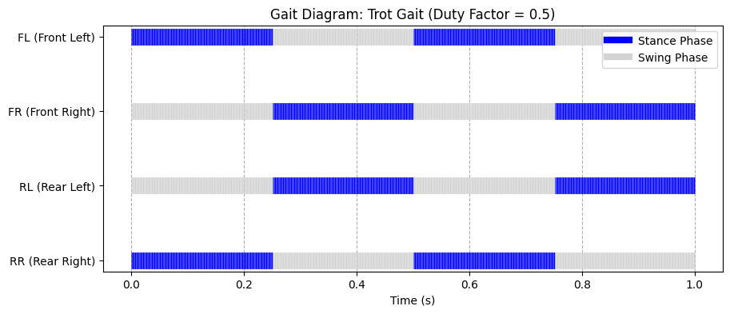
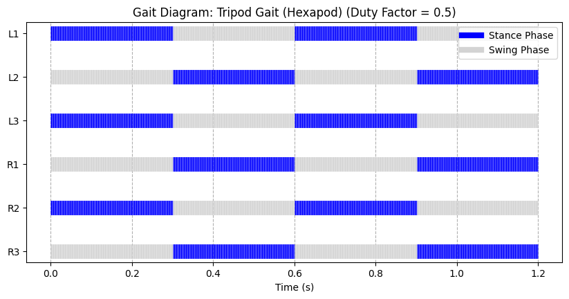

## Tugas Praktikum & Implementasi

1. **Generalisasi scheduler ke 6 kaki** — class `QuadrupedGaitScheduler`
   dirombak menjadi `LeggedGaitScheduler(legs, T)` yang generik, dapat
   menangani jumlah kaki berapa pun (4 maupun 6) tanpa mengubah logika
   `get_phase()` / `plot_gait_diagram()`.
2. **Matriks offsets & duty factor untuk Tripod Gait** — 6 kaki
   (`L1, L2, L3, R1, R2, R3`) dibagi menjadi dua tripod yang bergantian
   menapak:
   - Tripod A (offset `0.0`): `L1, L3, R2`
   - Tripod B (offset `0.5`): `L2, R1, R3`
   - Duty factor `β = 0.5`
3. **Plot diagram gait & verifikasi stabilitas** — diagram Gantt
   *stance/swing* untuk 6 kaki, dilanjutkan verifikasi numerik (jumlah kaki
   menapak di setiap titik waktu sepanjang siklus) dan verifikasi geometris
   (visualisasi *support polygon* segitiga dari sudut pandang atas, dengan
   pusat massa robot dicek berada di dalam poligon tersebut).

   Hasil verifikasi numerik:
   ```
   Jumlah kaki menapak (stance) sepanjang siklus -> min: 3, max: 3
   VERIFIKASI: Stabil secara statis -- minimal 3 kaki selalu menapak tanah
               di setiap saat, sehingga membentuk poligon topangan (support
               polygon) berbentuk segitiga yang valid sepanjang siklus.
   ```
4. **Analisis Trot (Quadruped) vs Tripod (Hexapod)** — ditulis di sel
   markdown terakhir notebook. Ringkasan:
   - **Trot**: hanya 2 kaki menapak sekaligus → support polygon berupa
     garis (luas nol) → *dynamically stable*, bergantung momentum gerak.
   - **Tripod**: selalu 3 kaki menapak sekaligus → support polygon
     berbentuk segitiga (luas > 0) → *statically stable*, robot dapat
     berhenti di fase mana pun tanpa jatuh.
   - Trade-off: tripod lebih stabil tapi kecepatan jelajah maksimumnya
     umumnya lebih rendah dibanding trot pada bobot/aktuator yang sebanding.

Gambar Perbandingan trot Quadruped dan Hexapod:



## Cara Menjalankan

### Google Colab (disarankan)
1. Buka [Google Colab](https://colab.research.google.com/).
2. `File > Upload notebook`, pilih `Gait_assignment.ipynb`.
3. `Runtime > Run all`.

### Lokal (Jupyter)
```bash
pip install numpy matplotlib jupyter
jupyter notebook Gait_assignment.ipynb
```

## Struktur Repo

```
.
├── Gait_assignment.ipynb   # Notebook utama (tugas + jawaban)
└── README.md                # File ini
```

## Catatan Implementasi Lanjutan

Saat mengintegrasikan luaran *gait scheduler* ini ke skrip
*forward/inverse kinematics*, pastikan *coxa* dipaksa beroperasi konstan
pada bidang XY, dan hapus titik koordinat *base* dari matriks simulasi
kaki untuk mencegah perhitungan matriks singular serta mempercepat
konvergensi algoritma IK saat transisi fase *stance* ke *swing*
